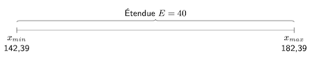
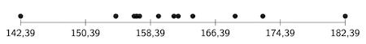

# Définition des classes

Maintenant que l'on sait ce que sont les classes, et la découpe en intervalles, voyons comment les définir à partir des observations réalisées sur un échantillon, pour une variable quantitative continue donnée.

On va d'abord déterminer le nombre de classes à définir, ensuite calculer la longueur qu'elles doivent avoir et enfin définir leurs intervalles.

## Nombre de classes

La première étape consiste à déterminer combien de classes doivent être définies. Il n'y a pas une seule et unique approche pour répondre à cette question. Par contre, on va pouvoir s'appuyer sur deux formules différentes qui vont nous donner une indication sur le nombre de classes qu'il faudrait avoir, sur base de la taille de l'échantillon.

### Règle de Sturges

La première règle que l'on peut utiliser pour déterminer le nombre de classes qu'il faut définir pour un échantillon est la *règle de Sturges*. On peut obtenir une approximation du nombre de classes à l'aide d'une version simplifiée de la règle.

::: info Définition
La règle de Sturges permet de déterminer le nombre de classes $k$ à définir pour un échantillon de taille $n$ :
$$k = 1 + \log_2 n. \tag{3.1}$$
:::

Une approximation de la règle de Sturges, plus facile à utiliser avec les calculatrices simples qui ne possèdent pas de touche pour le logarithme en base 2, mais bien une pour celui en base 10, est :
$$k \approx \displaystyle 1 + \frac{10}{3} \log_{10} n.$$

Le nombre de classes devant être un nombre entier, on arrondit généralement le résultat obtenu au nombre entier le plus proche.

::: info Exemple
Si l'on revient à notre exemple précédent, pour lequel on avait un échantillon avec $n = 14$ individus, on devrait définir :
$$\begin{array}{rcl}
k & = & 1 + \log_2 14 \\[2mm]
  & \approx & \displaystyle 1 + \frac{10}{3} \log_{10} 14 \approx 4,\!82... \approx 5 \textrm{ classes.}
\end{array}$$
:::

### Règle de Yule

Une autre règle pour déterminer le nombre de classes pour un échantillon est la *règle de Yule*. Cette règle, qui utilise une racine en base 4, est plus difficilement calculable sur une calculatrice simple.

::: info Définition
La règle de Yule permet de déterminer le nombre de classes $k$ à définir pour un échantillon de taille $n$ :
$$k = 2,\!5 \sqrt[4]{n}. \tag{3.2}$$
:::

Les deux règles que l'on vient de voir produisent généralement des résultats plutôt proches, et du coup identiques après arrondi. Il n'y a pas vraiment de règle à privilégier entre les deux présentées. L'utilisation de l'une ou de l'autre dépendra des possibilités de calcul à disposition.

::: info Exemple
Si l'on revient à notre exemple précédent, pour lequel on avait un échantillon avec $n = 14$ individus, on devrait définir :
$$k = 2,\!5 \sqrt[4]{14} = 4,\!83... \approx 5 \textrm{ classes.}$$
:::

## Étendue et longueur

Une fois le nombre de classes connu, on va devoir déterminer la *longueur* des classes. Dans les découpes que l'on étudie dans ce cours, on part du principe que toutes les classes ont la même longueur.

### Étendue de l'échantillon

La première information dont on a besoin est l'*étendue* de l'échantillon, à savoir la différence entre la plus grande et la plus petite observation faite sur les individus de l'échantillon, pour la variable $X$ sur base de laquelle on souhaite effectuer la découpe en classes.

::: info Définition
L'étendue d'un échantillon, notée $E$, pour la variable $X$ est la différence entre la plus grande observation $x_{max}$ et la plus petite $x_{min}$ réalisées pour la variable $X$ sur les individus de l'échantillon :
$$E = x_{max} - x_{min}. \tag{3.3}$$
:::

L'étendue nous donne donc la «&nbsp;longueur&nbsp;» totale qu'il faut découper en intervalles. Intuitivement, l'étendue correspond simplement à la distance qui sépare la valeur de début du premier intervalle $I_1$ et la valeur de fin du dernier intervalle $I_k$.

::: info Exemple
Si l'on revient à notre exemple précédent, on obtient une étendue de :
$$E = 182,\!39 - 142,\!39 = 40.$$

Visuellement, on peut représenter ce que l'on sait déjà comme suit :

  

:::

### Longueur des classes

Une fois l'étendue de l'échantillon connue, on va chercher la *longueur* des classes. Comme rappelé plus haut dans ce chapitre, on considère ici des découpes en classes ayant toutes la même longueur.

::: info Définition
La longueur des classes, notée $\ell$, pour un échantillon d'étendue $E$ découpé en $k$ classes, vaut :
$$\ell = \frac{E}{k}. \tag{3.4}$$
:::

Intuitivement, il suffit de diviser l'étendue de l'échantillon par le nombre de classes pour obtenir la longueur de ces dernières.

::: info Exemple
Si l'on revient à notre exemple précédent, on trouve que l'on doit définir des classes avec une longueur de :
$$\ell = \frac{40}{5} = 8.$$
:::

## Intervalles des classes

Enfin, une fois la longueur des classes connue, on va pouvoir réaliser la découpe en classes en définissant les *intervalles* qui sont couverts par chaque classe. On doit donc définir $k$ classes et, pour chacune, déterminer les valeurs entre lesquelles elle s'étend.

::: info Définition
La $i$e classe se note $j_i$ et l'intervalle correspondant se note :
$$j_i = [ j_{i, min}; j_{i, max} [. \tag{3.5}$$
:::

La $i$e classe va contenir tous les individus dont les observations associées ont une valeur comprise entre $j_{i, min}$ (inclus) et $j_{i, max}$ (exclu). Comme on le verra dans l'exemple plus loin, cette règle est adaptée pour la dernière classe pour qui la fin est également incluse.

Concrètement, pour définir les classes, on démarre avec la plus petite observation de l'échantillon pour obtenir le début de l'intervalle de la première classe et on lui ajoute la longueur des classes pour obtenir sa fin. La première classe $j_1$ se définit donc par l'intervalle suivant :
$$j_1 = [ x_{min}; x_{min} + \ell [.$$

Ensuite, l'intervalle de la deuxième classe débute là où celui de la classe précédente se termine, et ainsi de suite. La deuxième classe se définit en conséquence par l'intervalle suivant :
$$\begin{array}{rcl}
j_2 & = & [ x_{min} + \ell; (x_{min} + \ell) + \ell [ \\[1mm]
   & = & [ x_{min} + \ell; x_{min} + 2\ell [.
\end{array}$$

Notez que la dernière classe possède comme particularité que l'intervalle est fermé des deux côtés, la fin devant être incluse.

::: info Définition
Étant donné une longueur de classe de $\ell$ et la plus petite observation de l'échantillon $x_{min}$, la $i$e classe se note :
$$j_i = [ x_{min} + (i - 1) \ell; x_{min} + i \ell [. \tag{3.6}$$

Notez que $x_{min} + k\ell = x_{max}$ puisque la fin du dernier intervalle correspond à la plus grande observation de l'échantillon.
:::

::: info Exemple
Revenons à l'exemple d'étude statistique sur la taille des Belges. Pour rappel, la plus petite observation est $x_{min} = 142,\!39$ et la longueur des classes est $\ell = 8$. La première classe $j_1$ se définit par l'intervalle :
$$j_1 = [ 142,\!39; 142\!.39 + 8 [ = [ 142,\!39; 150,\!39 [.$$

Pour rappel, l'échantillon devait être découpé en $k = 5$ classes. Les intervalles des quatre classes suivantes sont :
$$\begin{array}{llll}
j_2 & = [ 150,\!39; 158,\!39 [ & j_4 & = [ 166,\!39; 174,\!39 [ \\
j_3 & = [ 158,\!39; 166,\!39 [ & j_5 & = [ 174,\!39; 182,\!39 ]
\end{array}$$

On voit bien que la fin du dernier intervalle est incluse.

Visuellement, on peut représenter les échantillons de notre exemple ainsi que la découpe en classes comme suit :

  

:::

