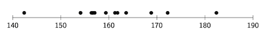

# Définition

L'idée derrière la notion de *classe* consiste à regrouper les observations réalisées pour une variable quantitative continue. Les valeurs les plus proches seront rassemblées dans une même classe.

Dans ce livre, on ne considère que la définition de classes pour des variables quantitatives continues à une dimension. Pour rappel, les observations faites pour ces variables possèdent une valeur numérique.

## Découpe en intervalles

La première notion nécessaire pour une discrétisation consiste à définir quelles observations sont rassemblées entre elles. Pour cela, l'ensemble des valeurs possibles couvrant les observations de l'échantillon est *découpé en intervalles*, chacun reprenant un sous-ensemble de ces valeurs couvertes. Plus précisément, un intervalle reprend toutes les valeurs comprises entre deux valeurs données, qui définissent l'intervalle.

::: info Définition
Un intervalle se définit par une valeur de début et une de fin, pouvant chacune être incluse ou exclue de l'intervalle.

Une valeur donnée fait partie de l'intervalle si elle est comprise entre la valeur de début et de fin (incluses ou exclues selon l'intervalle).
:::

La figure&nbsp;3.1 montre une représentation d'une découpe en intervalles de l'ensemble des valeurs comprises entre <i>début</i> et <i>fin</i>. Cet ensemble a été découpé en dix intervalles consécutifs, nommés $I_1$ à $I_{10}$, de même longueur. Ils contiennent donc tous le même nombre de valeurs.

<figure>
  
  <figcaption><b>Figure 3.1</b>&nbsp;–&nbsp;L'ensemble des valeurs comprises entre <i>début</i> et <i>fin</i> peut être découpé en dix intervalles consécutifs de même longueur, nommés <i>I1</i> à <i>I10</i>.</figcaption>
</figure>

Les intervalles d'une découpe pour définir des classes doivent recouvrir tout l'ensemble des valeurs possibles et être consécutifs. Concernant leurs longueurs, ils auront généralement tous la même pour permettre certains types d'analyses intéressantes, mais cela n'est pas une obligation.

::: info Exemple
Revenons sur l'exemple d'étude statistique sur la taille des Belges vu au chapitre précédent. Imaginons que les quatorze observations suivantes ont été réalisées pour la variable $X$, la taille, mesurée en centimètres :

  <table>
    <tr>
      <td>154,12</td>
      <td>156,62</td>
      <td>172,23</td>
      <td>156,38</td>
      <td>161,81</td>
      <td>180,82</td>
      <td>154,12</td>
    </tr>
    <tr>
      <td>179,82</td>
      <td>182,39</td>
      <td>142,39</td>
      <td>156,72</td>
      <td>159,38</td>
      <td>163,60</td>
      <td>157,05</td>
    </tr>
  </table>

On peut visuellement représenter ces observations, et donc les individus associés, par des points placés sur une ligne graduée, comme suit :

  

et les répartir en cinq intervalles, le premier partant de 140 pour finir à 150, le second s'étendant de 150 à 160, etc.
:::

## Classe

Pour une variable quantitative continue à une dimension, l'idée de la découpe en classes consiste à créer des *intervalles* consécutifs qui reprennent, chacun, une partie des individus avec l'observation associée.

Une *classe* est donc un regroupement d'individus, définie par un intervalle. Pour tous les individus se retrouvant dans une même classe, on considérera que les observations faites pour ces individus sont similaires, car proches, et représentées par l'intervalle.

::: info Définition
Pour une variable quantitative continue à une dimension, une classe est un intervalle de valeurs numériques délimité par une valeur de début et de fin (chacune incluse ou exclue) qui va reprendre les individus dont les observations associées pour la variable font partie de l'intervalle.
:::

Chaque classe possède une série de caractères qui peuvent être mesurés et utilisés à des fins d'analyses statistiques. Par exemple, on pourrait s'intéresser au nombre d'individus que comporte chaque classe.

## Nombre de classes

Le *nombre de classes* que l'on doit définir est une caractéristique importante à déterminer. En effet, si l'on définit trop peu de classes, on va perdre la richesse des observations qui ont été faites, car elles vont se retrouver réparties dans quelques classes. D'un autre côté, si l'on fait une découpe en trop de classes, il y en aura pleins qui seront vides.

::: info Exemple
Si l'on revient à notre exemple précédent, on pourrait ne définir qu'une seule classe qui s'étend de 140 à 190. Dans ce cas, tous les individus de l'échantillon vont s'y retrouver et être considérés comme similaires et ce sera comme si on avait plus qu'une seule «&nbsp;famille&nbsp;» d'individus.

On pourrait également décider de définir 49 classes qui s'étendent chacune sur une unité (de 140 à 141, de 141 à 142, etc.). Dans ce cas, la majorité d'entre elles seront vides et, en plus, on n'aura rien simplifié à la situation de départ.
:::
