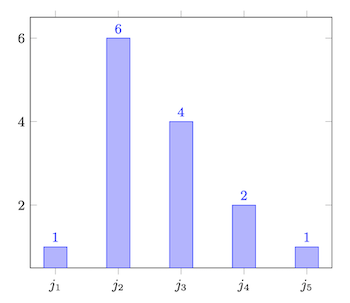
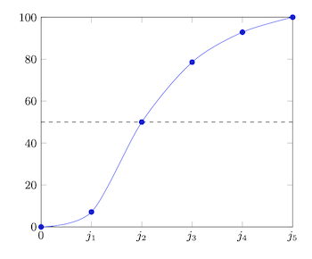

# Fréquence des observations

Terminons ce chapitre, et ce cours, par une notion qui va permettre une première analyse statistique des observations réalisées pour une variable donnée sur un échantillon donné.

## Fréquence

La simple analyse statistique que nous allons maintenant découvrir se base sur les *fréquences* d'apparition des différentes observations faites dans l'échantillon. Plus précisément, cette analyse revient à compter combien de fois chaque observation distincte apparait dans l'échantillon analysé. Au lieu de compter les nombres d'occurrences, on peut également s'intéresser à la *proportion* que prend chaque observation distincte au sein de l'échantillon, alors mesurée en pourcentage.

::: info Définition
La fréquence d'apparition d'une observation donnée dans un échantillon, notée $f$, est le nombre de fois qu'elle a été faite dans l'échantillon.
:::

Cette analyse peut être menée pour les variables qualitatives et pour les quantitatives discrètes. Concernant les variables quantitatives continues, elle sera généralement peu utile, car on se retrouvera généralement avec chaque observation distincte n'apparaissant qu'une seule fois.

::: info Exemple
Supposons que l'on s'intéresse au sexe biologique des client(e)s d'un magasin, représenté par la variable $S$, et que l'on a collecté cette information auprès d'un échantillon de douze client(e)s, ce qui a produit les observations suivantes :

  <table>
    <tr>
      <td>homme</td>
      <td>homme</td>
      <td>femme</td>
      <td>homme</td>
      <td>femme</td>
      <td>femme</td>
    </tr>
    <tr>
      <td>femme</td>
      <td>homme</td>
      <td>femme</td>
      <td>femme</td>
      <td>homme</td>
      <td>femme</td>
    </tr>
  </table>

La variable $X$ est une variable qualitative nominale avec deux valeurs possibles. On peut calculer les fréquences d'apparition des deux observations distinctes possibles que sont «&nbsp;homme&nbsp;» et «&nbsp;femme&nbsp;», et les résumer sous forme d'un tableau :

| Valeur    | Fréquence ($f$) | Proportion ($p$) |
|:----------|:----------------|:--------------------|
| femme     | 7               | 58,33%              |
| homme     | 5               | 41,67%              |
| **Total** | 12              | 100,00%             |

Cette simple analyse statistique nous permet de conclure que dans l'échantillon considéré, la proportion de femmes clientes du magasin est plus grande que celle des hommes. Notez que si l'échantillon est bien choisi et représentatif de la population, on pourrait inférer que le magasin est plus fréquenté par des femmes que des hommes.
:::

## Fréquence par classe

Comme mentionné plus haut, l'analyse des fréquences est généralement inutile pour des variables quantitatives continues.

Si l'on souhaite analyser une telle variable, il convient d'abord de la discrétiser selon la technique vue au chapitre précédent. On peut ensuite calculer les fréquences directement sur les classes, au lieu de le faire sur les observations distinctes, en prenant simplement en considération le nombre d'individus par classe.

::: info Exemple
Revenons à l'exemple d'étude statistique sur la taille des Belges. Pour rappel, on avait défini cinq classes, dont voici les fréquences d'apparition des individus, et donc des observations associées, dans chaque classe :

| Classe    | Fréquence ($f$) | Proportion ($p$) |
|:----------|:----------------|:-----------------|
| $j_1$     | 1               | 7,14%            |
| $j_2$     | 6               | 42,86%           |
| $j_3$     | 4               | 28,57%           |
| $j_4$     | 2               | 14,29%           |
| $j_5$     | 1               | 7,14%            |
| **Total** | 14              | 100,00%          |

Cette simple analyse révèle que la classe la plus représentée est la deuxième. Les tailles les plus fréquentes dans l'échantillon sont donc celles comprises entre 150,39&nbsp;m (inclus) et 158,39&nbsp;m (exclu).
:::

En voyant le résultat de l'exemple ci-dessus, on peut remarquer qu'après une discrétisation, on obtient une variable qualitative ordinale dont les valeurs possibles sont les classes. Notez également que l'on peut procéder à une discrétisation d'une variable quantitative discrète si l'ensemble de ses valeurs possibles est trop grand. Cela nous permettra de faire une simple analyse statistique par fréquence qui soit utile.

## Fréquence cumulée

Une autre valeur intéressante est la *fréquence cumulée*. Pour une observation donnée, il s'agit de la somme des fréquences pour toutes les observations qui sont plus petites ou égales à l'observation donnée.

::: info Définition
La fréquence cumulée d'apparition d'une observation donnée dans un échantillon, notée $c$, est le nombre de fois que cette observation, et toutes celles plus petites qu'elle, ont été faites dans l'échantillon.
:::

Notez que cette fréquence cumulée ne pourra se calculer que si l'on peut établir un ordre entre les valeurs possibles de la variable considérée. On ne pourra donc l'obtenir que pour les variables qualitatives ordinales et toutes les variables quantitatives.

Reprenons l'exemple d'enquête de satisfaction auprès des clients d'un supermarché. Grâce à la fréquence cumulée, on pourrait facilement savoir combien de clients de l'échantillon ont une satisfaction de six points ou moins. Pour cela, il suffit de calculer la fréquence cumulée pour l'observation correspondant à six points de satisfaction.

::: info Exemple
Revenons à l'exemple d'étude statistique sur la taille des Belges. On peut compléter le tableau précédemment présenté pour y ajouter les fréquences cumulées, en nombre d'occurrences et en pourcentage :

| Classe    | Fréquence ($f$) | Fréquence cumultée ($c$) | Proportion cumulée |
|:----------|:----------------|:-------------------------|:-------------------|
| $j_1$     | 1               | 1                        | 7,14%              |
| $j_2$     | 6               | 7                        | 50,00%             |
| $j_3$     | 4               | 11                       | 78,57%             |
| $j_4$     | 2               | 13                       | 92,86%             |
| $j_5$     | 1               | 14                       | 100,00%            |
| **Total** | 14              | –                        | –                  |

On peut remarquer que la fréquence cumulée pour la plus grande observation correspondant au total des fréquences. Ceci est logique puisque, par définition, on calcule donc la somme des fréquences de toutes les observations possibles de l'échantillon.
:::

## Distribution

Terminons ce cours avec une dernière notion, à savoir celle de *distribution* des fréquences. Intuitivement, l'idée est de voir comment les fréquences se répartissent entre les différentes valeurs possibles. Dans le cadre de ce cours, nous allons juste aborder l'intuition de ce concept.

::: info Définition
La distribution des fréquences définit la manière avec laquelle les fréquences des différentes valeurs d'une variable se répartissent.
:::

Pour comprendre cette notion, nous allons la visualiser à l'aide d'un *histogramme*, une représentation graphique composée de bâtonnets, chacun représentant la fréquence d'une valeur possible d'une variable ou d'une classe. En examinant la silhouette prise par l'ensemble des bâtonnets, on peut conclure une série d'éléments intéressants.

::: info Exemple
Revenons à l'exemple d'étude statistique sur la taille des Belges. Voici l'histogramme correspondant à l'exemple, obtenu à partir du tableau reprenant les fréquences pour les cinq classes :

  

Sur base de l'histogramme, on voit rapidement que la majorité des individus de l'échantillon, et donc des observations associées, se situe dans la deuxième classe, avec des tailles comprises entre 150,39&nbsp;m (inclus) et 158,39&nbsp;m (exclu), et qu'ensuite, la majorité du reste de l'échantillon est plutôt plus grand, suivant la distribution que l'on voit, avec un seul individu à chaque extrême.
:::

Pour les variables pour lesquelles on peut calculer la fréquence cumulée, un autre type de visualisation peut être utilisé à des fins d'analyse. Il s'agit simplement d'une *courbe* d'évolution de la fréquence cumulée.

::: info Exemple
Revenons à l'exemple d'étude statistique sur la taille des Belges. Voici la courbe d'évolution de la fréquence cumulée correspondant à l'exemple :

  

Ce que l'on peut, par exemple, observer, c'est que la moitié des individus, et donc des observations associées, se situe dans les deux premières classes. L'autre moitié se répartit sur les trois dernières classes.
:::
