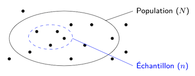

# Population et échantillon

En statistique, on collecte donc des données en lien avec le phénomène étudié. La première étape à franchir pour se lancer dans une analyse consiste à caractériser le *sujet de l'étude*. Cela se fait généralement en identifiant la population et ses individus, et également l'échantillon.

## Individu

La notion d'*individu* permet de représenter le *sujet* d'une étude statistique. Les individus statistiques caractérisent les éléments individuels que l'on souhaite étudier dans le cadre de l'analyse qui est menée. On se réfère généralement à l'ensemble des individus avec la notion d'*Univers*.

::: info Définition
Un individu statistique représente un élément individuel auquel on s'intéresse dans le cadre d'une analyse statistique.
:::

Pour les trois exemples d'étude vus dans l'[introduction de ce chapitre](../), les individus correspondent à des êtres humains. C'est, en effet, auprès d'êtres humains que des données seront collectées.

Les individus statistiques peuvent, par ailleurs, correspondre à des objets, voire à des concepts plus abstraits, comme des évènements, par exemple. Imaginons que l'on s'intéresse aux hauteurs des sapins des forêts en Ardenne. Dans ce cas, les individus seront des arbres, à savoir les sapins vivant dans les Ardennes belges. Prenons un autre exemple où l'on s'intéresse au temps passé par les internautes sur les pages d'un site web. Dans ce cas, les individus seront des visites de page.

## Population

La notion de *population* permet de représenter l'ensemble des individus statistiques concernés par l'étude que l'on souhaite mener. La *taille* d'une population, notée $N$, représente le nombre d'individus faisant partie de cette population. La figure&nbsp;1.1 illustre ce concept en montrant tous les individus de l'Univers (représentés par les points) et ceux qui font partie de la population (délimités par l'ellipse).

<figure>
  
  <figcaption><b>Figure 1.1</b>&nbsp;–&nbsp;La population reprend tous les individus statistiques qui sont considérés par l'analyse que l'on souhaite mener, parmi tous les individus de l'Univers.</figcaption>
</figure>

::: info Définition
Une population représente l'ensemble de tous les individus qui sont concernés par l'analyse statistique que l'on mène. Sa taille, $N$, est le nombre d'individus qu'elle comporte.
:::

Si l'on revient à l'exemple de taille des Belges, l'Univers reprend tous les êtres humains et la population se limite aux Belges. La taille de cette population était de $N$ = 11.748.716 au 1er janvier 2024, selon l'[office belge des statistiques](https://statbel.fgov.be/fr) (Statbel). Pour les deux autres exemples vus dans l'introduction, la population reprend respectivement les employés de l'entreprise et les êtres humains vivants ou ayant vécu au 21e siècle.

## Échantillon

Lorsque l'on veut réaliser une analyse statistique, il est généralement impossible d'analyser tous les individus de la population. Une solution consiste à se concentrer sur un sous-ensemble de la population que l'on appelle *échantillon*. La *taille* d'un échantillon, notée $n$, représente le nombre d'individus qu'il contient. La figure&nbsp;1.2 montre les individus qui font partie de l'échantillon (délimité par l'ellipse en pointillés).

<figure>
  
  <figcaption><b>Figure 1.2</b>&nbsp;–&nbsp;L'échantillon reprend tous les individus de la population auprès desquels des données sont collectées pour mener à bien une analyse statistique.</figcaption>
</figure>

::: info Définition
Un échantillon est le sous-ensemble d'une population reprenant les individus auprès desquels des données sont collectées pour l'analyse statistique menée. Sa taille, $n$, est le nombre d'individus qu'il comporte.
:::

Notez que la taille d'un échantillon est au maximum de $N$, lorsque ce dernier reprend tous les individus de la population. La population étant généralement très grande, $n$ est souvent beaucoup plus petite que $N$.

Par exemple, pour notre étude de la taille des Belges, on pourrait imaginer mener une enquête auprès de $n$ = 2.500 personnes. L'ensemble des Belges interrogés forme l'échantillon et c'est sur les individus de ce dernier que des données seront collectées.
