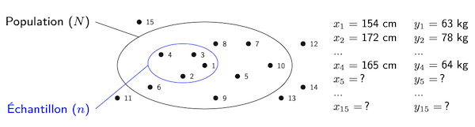

# Observation

Une variable ne possède pas de valeur en tant que telle, mais en a une pour chaque individu de la population d'intérêt. Dans le cadre d'une étude statistique, et une fois la ou les variables d'intérêt définies, ces dernières sont analysées pour chaque individu de l'échantillon.

Une *observation* correspond à la valeur d'une variable pour un individu donné. Lors d'une étude statistique, plusieurs observations sont donc faites, généralement lors du processus de collecte de données.

::: info Définition
Une observation pour une variable $X$ donnée correspond à la valeur de cette variable pour un individu donné de l'échantillon. L'observation faite pour le $i$e individu est notée $x_i$.
:::

Une fois toutes les observations faites pour une variable $X$, on se retrouve avec un total de $n$ observations, à savoir une pour chaque individu de l'échantillon.  On peut les représenter sous la forme d'un tableau.

::: info Exemple
Revenons à notre exemple d'étude sur la taille des Belges. Le tableau suivant reprend une partie des observations qui correspondent aux variables $X$ et $Y$ définies précédemment.

<figure>

| N° de l'individu ($i$) | Taille en cm ($x_i$) | Poids en kg ($y_i$) |
|:-----------------------|:---------------------|:--------------------|
| 1                      | 154                  | 63                  |
| 2                      | 172                  | 78                  |
| $\dots$                | $\dots$              | $\dots$             |
| $n$                    | 165                  | 64                  |

</figure>

On y voit, par exemple, que le premier individu analysé a une taille de $x_1$ = 154&nbsp;cm et un poids de $y_1$ = 63&nbsp;kg. La notation $x_1$ représente la valeur de la variable $X$ pour le premier individu analysé et $y_1$ correspond à la valeur de la variable $Y$ pour ce même individu. Le tableau complet comporte $n$ lignes, ce qui correspond bien à la taille de l'échantillon.
:::

De manière générale, tous les individus ont une valeur pour une variable donnée, si ce n'est que l'on ne la connait pas toujours. En effet, ces valeurs ne sont connues que pour les individus auprès desquels des données ont été collectées, c'est-à-dire ceux faisant partie de l'échantillon.

La figure&nbsp;2.1 illustre cela en montrant tous les individus numérotés et les observations réalisées pour les quatre de l'échantillon, les seuls pour qui la valeur de la variable est connue. Les autres individus ont une valeur pour les différentes variables analysées, mais elles sont inconnues.

<figure>
  
  <figcaption><b>Figure 2.1</b>&nbsp;–&nbsp;Pour chaque individu de la population, des observations peuvent être réalisées pour chaque variable d'intérêt de l'étude statistique.</figcaption>
</figure>
