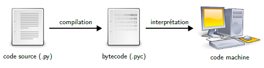

# Exécution de code Python

Le premier élément sur lequel il est possible d'agir pour minimiser le temps d'exécution d'un programme, ou sa consommation mémoire, consiste à utiliser le meilleur *interpréteur Python* possible pour votre machine. En effet, le code source d'un programme Python n'est pas directement exécuté par votre machine physique, comme l'illustre la figure&nbsp;2.1 où on voit que l'on va du *code source* au code machine.

<figure>
  
  <figcaption>Figure 2.1&nbsp;–&nbsp;Un code source Python (<code>.py</code>) est généralement d'abord compilé en un fichier intermédiaire (<code>.pyc</code>) qui est ensuite interprété sur la machine cible.</figcaption>
</figure>

## Interpréteur

Un code source Python est tout d'abord *compilé* en une forme intermédiaire, appelée *bytecode*, sauvegardée dans un fichier `.pyc` que l'on peut retrouver dans le dossier `__pycache__`. Le principal but de cette étape est d'éviter de réanalyser le code source à chaque fois que vous allez exécuter le même programme, sans l'avoir modifié.

Voici une simple fonction qui affiche une phrase sur la sortie standard :

``` python
def hello():
    print('Hello World!')
```

À l'aide du *module `dis`*, on peut obtenir une forme lisible du bytecode correspondant à cette fonction. Il est simplement constitué d'une séquence d'instructions à exécuter :

```
  2           0 LOAD_GLOBAL              0 (print)
              2 LOAD_CONST               1 ('Hello World!')
              4 CALL_FUNCTION            1
              6 POP_TOP
              8 LOAD_CONST               0 (None)
             10 RETURN_VALUE
```

Notez bien qu'il ne s'agit pas du tout d'une version optimisée, ni plus rapide, du code source, mais bien d'une forme compilée intermédiaire qui sera ensuite plus facile à exécuter pour l'*interpréteur Python*.

Si vous exécutez cette fonction `hello` avec l'interpréteur *CPython*, les six instructions bytecode montrées ci-dessus seront exécutées par ce dernier. Il s'agit de la seconde étape de la figure&nbsp;2.1, où le bytecode est interprété, c'est-à-dire transformé à la volée en *code machine* selon l'ordinateur sur lequel le programme est exécuté.

Pour être plus précis, le bytecode est exécuté sur une *machine virtuelle Python* qui, elle-même, tourne sur votre machine physique. Et c'est justement sur cet élément que l'on peut jouer pour améliorer les performances de l'exécution, en choisissant une machine virtuelle qui optimise le mieux l'exécution du bytecode pour votre propre machine.

## Implémentation de Python

Plusieurs autres implémentations que CPython, l'implémentation officielle écrite et maintenue par la *Python Software Foundation*, existent pour le langage de programmation Python.

Le tableau&nbsp;2.1 reprend quelques-unes de ces implémentations alternatives. La plus connue est *PyPy*, une implémentation écrite en RPython qui a pour but d'être optimisée pour la vitesse d'exécution et la consommation mémoire. Une plus récente, écrite en C et Python comme CPython et qui mérite de l'attention, est *Pyston*.

<figure>

  | Nom              | Dernière version                           | Langage      | Python |
  |:-----------------|:-------------------------------------------|:-------------|:-------|
  | CPython          | 3.11.0 <small>(24 octobre 2022)</small>    | C, Python    | 3.11.0 |
  | PyPy             | 7.3.10 <small>(6 décembre 2022)</small>    | RPython      | 3.7    |
  | Pyston           | 2.3.5 <small>(26 septembre 2022)</small>   | C, Python    | 3.8.12 |
  | Jython           | 2.7.3 <small>(10 septembre 2022)</small>   | Java, Python | 2.7    |
  | IronPython       | 2.7.12 <small>(21 janvier 2022)</small>    | C#           | 2.7    |
  | Stackless Python | 3.8.1-slp <small>(22 janvier 2020)</small> | C, Python    | 3.8.1  |
  | Brython          | 3.11.2 <small>(3 mars 2023)</small>        | JavaScript   | 3.11   |

  <figcaption>Tableau 2.1&nbsp;–&nbsp;Plusieurs implémentations du langage Python existent, soit pour optimiser les performances d'exécution, soit pour faciliter les interactions avec un autre langage.</figcaption>
</figure>

D'autres implémentations ont pour but de faciliter l'intégration de Python dans un écosystème existant. Par exemple, *Jython* permet d'utiliser la librairie standard Java en Python, puisqu'il exécute des programmes Python dans la machine virtuelle Java. *IronPython* fait pareil, mais pour l'environnement .NET de Microsoft. Malheureusement, ces deux dernières implémentations ne supportent actuellement que la version 2 du langage Python, qui est aujourd'hui dépréciée.

On retrouve également *Stackless Python*, une implémentation qui permet de gérer très efficacement des micro-threads pour des programmes évènementiels efficaces. On peut également utiliser Python comme langage de script client pour des pages web à l'aide de *Brython*.
