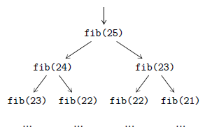

# Flux d'exécution

Enfin, pour conclure ce chapitre, un dernier élément sur lequel il est possible de jouer pour optimiser un code, c'est le *flux d'exécution*. Il est très important de choisir, voire de développer, le bon algorithme pour chaque problème à résoudre. Il est également important de connaitre les possibilités offertes par le langage de programmation.

Comme abordé dans [le chapitre suivant](../../mesure-de-performance/), l'utilisation d'outils de mesure de performance permet d'identifier des goulots d'étranglement dans des algorithmes, et donc des zones d'optimisation éventuelle.

## Tri de liste

Si on prend l'exemple du tri d'une liste de nombres, on peut déjà observer que bien choisir son algorithme a de l'importance. Par exemple, pour trier une liste déjà triée ou presque triée, le *tri par insertion* sera généralement plus rapide que le *tri rapide*.

En prenant deux implémentations *en place*, et en les exécutant sur la même liste triée de 800 éléments, on passe de 19&nbsp;ms avec le tri par insertion à 31&nbsp;ms avec le tri rapide, soit une augmentation de temps de 39%. Il faut, en effet, se rappeler que le tri rapide a une complexité temporelle de $\mathcal{O}(n^2)$ dans le pire cas, à comparer à une complexité temporelle de $\mathcal{O}(n)$ dans le meilleur cas pour le tri par insertion.

La deuxième chose à savoir est qu'il ne faut pas forcément toujours réimplémenter les algorithmes <i>&laquo;&nbsp;connus&nbsp;&raquo;</i> soi-même. Il est, en effet, possible d'utiliser des fonctions prédéfinies pour réaliser plus efficacement le tri par insertion et le tri rapide :

``` python
def insertion_sort(data):
    for i in range(1, len(data)):
        bisect.insort(data, data.pop(i), 0, i)

def quick_sort(data):
    data.sort()
```

Sur la même liste de 800 éléments, on passe de 19&nbsp;ms à 0,7&nbsp;ms pour le tri par insertion et de 31&nbsp;ms à 5&nbsp;µs pour le tri rapide. On obtient donc respectivement des diminutions de temps de 96% et 99,98%.

## Cache

Parfois, une même fonction est appelée plusieurs fois dans un même programme, avec exactement les mêmes paramètres. Si la fonction s'avère couteuse à exécuter, cela peut ralentir le programme. Prenons, par exemple, la fonction suivante qui calcule le $n$<sup>e</sup> nombre de Fibonacci :

``` python
def fib(n):
    if n <= 1:
        return n
    return fib(n - 1) + fib(n - 2)
```

Supposons que l'on souhaite calculer le 25<sup>e</sup> nombre de Fibonacci. Pour cela, on exécute l'appel de fonction `fib(25)` et la condition du `if` n'étant pas satisfaite, on se retrouve à devoir exécuter les deux appels `fib(24)` et `fib(23)`. Chacun de ces deux appels va nécessiter deux nouveaux appels, à savoir `fib(23)` et `fib(22)` pour le premier et `fib(22)` et `fib(21)` pour le second, et ainsi de suite comme illustré par la figure&nbsp;2.2. On se retrouve en fait à exécuter plusieurs fois le même appel, ce qui n'est absolument pas efficace. En effet, il faut 39&nbsp;ms de temps d'exécution pour calculer le 25<sup>e</sup> nombre de Fibonacci, une seule fois.

<figure>
  
  <figcaption>Figure 2.2&nbsp;–&nbsp;Des millions d'appels récursifs sont exécutés suite à l'appel <code>fib(25)</code>, lorsque l'on veut calculer le 25<sup>e</sup> nombre de Fibonacci avec la fonction récursive présentée plus haut.</figcaption>
</figure>

Grâce au décorateur `lru_cache` du *module `functools`*, on va pouvoir sauvegarder les résultats des appels les plus récents pour éviter de devoir les recalculer. Voici comment on peut simplement faire pour stocker le résultat des 128 appels les plus récents :

``` python
@lru_cache(maxsize=128)
def fib(n):
    if n <= 1:
        return n
    return fib(n - 1) + fib(n - 2)
```

Cette fois-ci, pour calculer le 25<sup>e</sup> nombre de Fibonacci, il ne faut plus que 0,3&nbsp;µs, soit une diminution de temps de 99,999%.

Cette technique, connue sous le nom de *mémoïsation*, consiste à utiliser plus de mémoire pour gagner du temps de calcul, en stockant dans une *mémoire cache* les résultats d'appels de fonction pour éviter de les exécuter plusieurs fois. Le décorateur `lru_cache` du module `functools` permet d'éviter de gérer cette mémoïsation <i>&laquo;&nbsp;manuellement&nbsp;&raquo;</i>.

## Itérateur

Enfin, terminons avec le *module `itertools`* qui contient toute une série de fonctions qui permettent de construire des itérateurs divers et variés, à directement utiliser comme blocs de base dans des algorithmes. On y retrouve, par exemple, la *fonction `product`* qui permet de calculer le produit cartésien de deux collections. Voici deux fonctions qui permettent de calculer ce produit :

``` python
def pairs_1(a, b):
    return [(i, j) for i in a for j in b]

def pairs_2(a, b):
    return list(product(a, b))
```

La seconde fonction est plus rapide que la première. En effet, on passe de 193&nbsp;ms à 134&nbsp;ms pour calculer le produit cartésien de deux listes de 1000 éléments, soit une diminution de temps de 31%.
